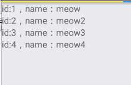
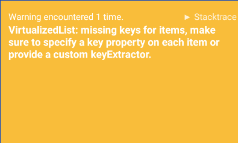
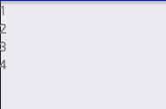

# ListView与FlatList

当你需要给用户在一个页面展示一堆数据的时候，一个一个去渲染对性能来说真的不好，所以我们使用React Native内置的列表
来渲染数据。在0.43版本之前，我们一直使用ListView来渲染数据，不过它的性能经常被人吐嘈，社区里也不断提出解决方案。
就连Realm都内置了一个性能更好些的ListView。不过自从官方发布了0.43版之后，这种局面应该会离我们远去了，因为官方给出了
更好的方案FlatList。不过，ListView虽然老旧了一些，但依然还有学习的必要，所以我们从ListView开始学起

## ListView

对于ListView来说，我们需要一个数据源，这样ListView才有渲染视图的原料。这些数据可以放到一个数组里面(从Realm取出的数据可以直接用ListView渲染)，
首先定义取值策略，我们一般采用这种方式(上下数据不相等时更新数据)：

```
const ds = new ListView.DataSource({ rowHasChanged: (r1, r2) => r1 !== r2 });
```
然后我们来创建一个数组来储存数据：

```
const data = [
    {
        id: 1,
        name: 'meow'
        },
    {
        id: 2,
        name: 'meow2'
    },
    {
        id: 3,
        name: 'meow3'
    },
    {
        id: 4,
        name: 'meow4'
    }        
]
```

准备好后，我们开始使用ListView，别忘记引用它：

```
import {
  ....,  
  ListView
} from 'react-native';
```

然后随便找个视图丢个ListView进去，然后用刚才初始化好的`ds`来接受数据并使用renderRow渲染数据：

```
<ListView
    dataSource={ds.cloneWithRows(data)}
    renderRow={(rowData) => <Text>id:{rowData.id}，name：{rowData.name}</Text>}
/>
```

没加任何样式，不过数据愉快的渲染出来了：



我们可以用列表渲染文字，图片，在列表里嵌套组件等等，还可以像寻常组件一样为其添加各种样式。因为写样式就像寻常组件一样，所以这里
就不再说了。

除了传递`rowData`，还可以传递`sectionID, rowID`来获取section id和 row id，如果对这两个参数感兴趣就自己动手做下试验。

再提一个和性能有关的属性`initialListSize`，这个属性可以指定首屏渲染多少数据，避免造成性能损耗。

```
<ListView
...
initialListSize={123}
/>
```

## FlatList

FlatList是一个高性能的列表，为什么要使用它我们在开篇介绍已经讲过，下面我们来看一个简单的例子：

```
<FlatList
    data={data}
    renderItem={ ({ item }) => <Text>{item.id}</Text> }
/>
```

这里的data是在ListView例子中用过的data，不过呢，这段代码并不能运行，因为FlatList需要每行都有一个不同的key，所以我们
需要炮制一下data。至于这个提示，先看前半句：




之前在创建data的时候我们用了const，为了后边能够修改data，我们将const改成let。
然后写一小段代码为data添加key：

```
for (let i = 0; i < data.length; i++) {
  data[i].key = i
}
```



然后data就可以丢到FlatList中使用了(使用新组件别忘记引入)。另外，在现在的版本中data只能是一个普通数组，不可以是别的复杂数据结构(为了简单)。

接下来，我们来看FlatList支持的属性。

FlatList默认竖式布局，但是只要设置`horizontal`属性为true，列表就会变成横的：

```
horizontal={true}
```

刚才为data添加key的那一步其实并没有必要，因为有`keyExtractor`属性，我们可以通过这一属性来指定key，拿刚才的data来举例：

```
keyExtractor={ (item, index) => item.id }
```

然后是三个比较像的组件`ListHeaderComponent`，`ItemSeparatorComponent`，`ListFooterComponent`，
在这三个属性中，我们向其中分别会放头部组件，分隔组件，尾部组件。
举一个简单的例子：

```
ListHeaderComponent={()=>{return <Text>我是头部</Text>}}
ItemSeparatorComponent={()=>{return <Text>我是分隔组件</Text>}}
ListFooterComponent={()=>{return <Text>我是尾部</Text>}}
```


实际使用的时候记得把组件单独拿出来，这里这么写只是为了方便。
FlatList为了优化内存占用并保证流畅滑动会在屏幕外异步绘制列表内容（看不到的地方用空白代替items），所以如果用户滑动过快就会看到空白内容，
对于这个问题，我们可以使用`getItemLayout`属性来有优化，不过你得知道内容的行高才能用：

``` 
//xxx是行高
getItemLayout={(data, index) => (
    { length: xxx, offset: xxx * index, index }
)}
```

介绍的最后一个组件在当前版本（0.43）有点小问题`onEndReached`有时候会不触发，所以只好期待下一个版本喽

`onEndReached`是当列表滑到尾部会调用的一个属性（距离尾部不足这个`onEndReachedThreshold`的大小），我们可以用它来更新列表数据什么的：

```
onEndReached={()=>{
//更新数据
}}
```

与`onEndReachedThreshold`是个好基友，我们在里边放些数字，如果滑动列表就好触发`onEndReached`的话，我们需要设置`onEndReachedThreshold`的值
为0
```
onEndReachedThreshold={0}
```