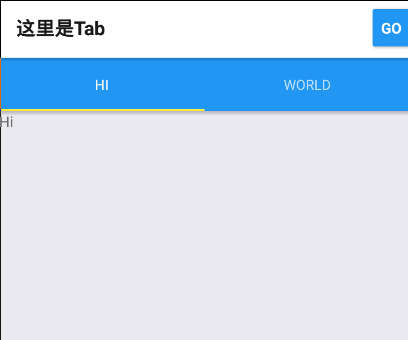

# 导航器

一个应用（普通的那种），总是有好多个界面，只有一个界面的应用怎么能留得住用户呢？（虽然有很多界面的也不一定留得住）
所以说，做应用一般不会只做一个页面。我们知道，网页之间可以自由跳转，通过一个`<a></a>`就可以搞定了，但是
开发应用不是写网页，React Native中也没有`<a>`，那当我们需要做界面跳转的时候该怎么办呢？答案是使用`Navigator`组件。
哈哈，逗你的，在0.42版本前使用`Navigator`来实现导航效果没问题，不过呢，自从0.43版本之后React Native将停止维护这个组件了，
因为出现了更好用的`React Navigation`（半官方）。

首先我们来安装它：

```
npm install --save react-navigation
```

然后重新启动你的应用

作者君在安装这个库的时候，它的版本是beta7,有一个小bug需要处理一下，删掉`node_modules/react-navigation/src/views/Header.js`的第12行，

```
import ReactComponentWithPureRenderMixin from 'react/lib/ReactComponentWithPureRenderMixin';
````

不然直接红屏报错。

安装完毕后，我们来一个简单的例子，首先我们需要引入它：

```
import { StackNavigator } from 'react-navigation';
```

然后写两个组件，一个叫`HelloScreen`，一个叫`UserScreen`：

```
class HelloScreen extends Component {
  static navigationOptions = {
    title: 'Hello',
  };
  render() {
    const { navigate } = this.props.navigation;
    return (
      <View>
        <Text>{'\n'}</Text>
        <Text>按下边的按钮</Text>
        <Button
          onPress={() => navigate('User')}
          title="Go"
        />
      </View>
    );
  }}

  class UserScreen extends Component {
  static navigationOptions = {
    title: '这里是~',
  };
  render() {
    return (
      <View>
        <Text>{'\n'}</Text>
        <Text>嘿，猜猜这里是谁？</Text>
      </View>
    );
  }
}

```

>其实在按钮里面写方法并不优雅，翻过了issues之后觉得都不是很好，所以这里就期待一下官方的变化吧

这两个组件和正常的组件差不多，不过是多了些东西罢了。其中，`navigationOptions`数组里可以放些配置信息，一般用来配置Header部分。
HelloScreen里的`const { navigate } = this.props.navigation`是为了可以在组件中使用`navigate`方法。`navigate(...)`理解成
跳转到那个界面就好。不过，光有这两个组件可看不出来什么，我们还需要一个`StackNavigator`来使导航可以正常运作。（可以把这个当成一个特殊的组件，更好理解）：

```
const MyApp = StackNavigator({
  Home: { screen: HelloScreen },
  User: { screen: UserScreen },
});
```

这里的`Home`和`User`是路由别名，在使用`navigate`时需要用到。然后改一下注册的组件，就像下边那样：

```
AppRegistry.registerComponent('AppName', () => MyApp);
```

好啦，我们刷新一下应用：


然后点一下Go按钮：


就像这样，几行代码轻轻松松便实现了导航效果，甚至连头部都帮你做好了~

## 参数传递


很多时候，我们需要像要跳转的界面传递些参数，比如，某条数据的id，用户的名字。我们只需要把上边的例子小小的修改一下就可以传递参数了：

```
//修改navigate方法
navigate('User', { id: '233333333', name: 'nico' });
```

然后接受参数：

```
render() {
    const { params } = this.props.navigation.state;
    return (
      <View>
        <Text>{'\n'}</Text>
        <Text>嘿，这里是{params.name}，id是：{params.id}<</Text>
      </View>
    );
  }
```

这样就实现参数的传递啦，快刷新一下看看效果吧~

## 定制头部

前边说过，`navigationOptions`里面会放些配置信息，我们可以用这个来定制头部，比如说在右边加一个按钮：

```
static navigationOptions = {
  title: 'hahaha',
  headerRight: <Button title="你好" />,
}
```

理论上来说，它会在右边显示一个按钮，但是并不行，一脸茫然的作者君去翻了下GitHub，发现别人也遇到了这些问题，然后默默的更新了
一下`react-navigation`，从beta7升到了beta9：

```
npm update react-navigation
```

然后刷新一下应用就可以发现按钮乖乖的显示在那里了：


除了按钮，你还可以丢个<Text>之类的过去，都是可以的。


## Tab Navigator

如果需要Tab导航，我们使用其内置的`TabNavigator`即可，用法和`StackNavigator`差不多，只要在最后使用`TabNavigator`即可
就像这样：

```
const XXX = TabNavigator({
  ......
})
```

如果想要混用`StackNavigator`和`TabNavigator`则稍稍麻烦一点，首先，我们写两个新的组件：

```
class HiScreen extends Component {
  render() {
    return <Text>Hi</Text>
  }
}

class WorldScreen extends Component {
  render() {
    return <Text>World</Text>
  }
}
```

然后使用`TabNavigator`：

const TabScreen = TabNavigator({
  Hi: { screen: HiScreen },
  World: { screen: WorldScreen },
});

这里的`Hi`，`world`会被作为选项卡（Tab）的名字，然后修改MyApp:

```
const MyApp = StackNavigator({
  Home: { screen: TabScreen },
  User: { screen: UserScreen },
});
```

刷新一下应用，会发现公用的头部是空白的：


没关系，我们来添加一下：

```
TabScreen.navigationOptions = {
  title: '这里是Tab'
};
```

和别的导航组件，你也可以丢个按钮进去：



最后，我们来写一个可以跳转到UserScreen的按钮(别忘记navigate)：

```
//HiScreen
const { navigate } = this.props.navigation;
    return (
      <View>
        <Text>Hi</Text>
        <Button
          onPress={() => navigate('User', { id: '233333333', name: 'nico' })}
          title="Go"
        />
      </View>
    )
```    

然后刷新一下看看是否成功吧~