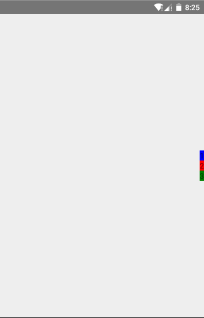
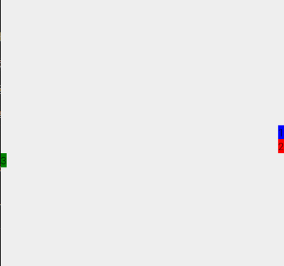
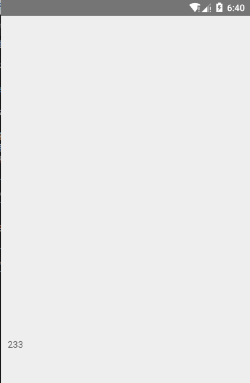
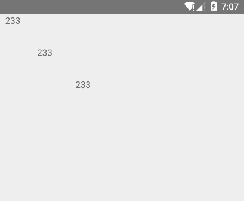

# 是时候说说样式与布局了

本章提要

- 样式
- 布局
- Dimensions

## 样式
在前几章说了一些样式，是不是有点懵了呢？没关系，我们一起看看样式在React Native中的使用。

在React Native中，写样式和写CSS差不多，只不过是把`-`的连接方式换成了小驼峰式。又把`;`换成了`,`，有的时候要把值加上分号，比如这样：

```
background-color: green; --->  backgroundColor: 'green',
```

实际上，React Native的样式算是CSS的一个子集，当发现有些样式不能用的话不要惊讶，试着换用别的方式来实现就好~

作者君总结了一些常用的样式放到了附录里，可以作为写样式时的参考。

我们知道，代码总是会越写越多，样式也一样。所以为了效率，为了样式的整洁，我们写样式用`StyleSheet.create`比较好，不过只是写着玩玩的话，
怎么写都好。下面我们来看看这种定义样式的方法

```
const styles = StyleSheet.create({
    content: {
        backgroundColor: '#fff',
        height: 50,
        width: 100
    },
    text: {
        color: 'blue',
        textAlign: 'center'
    }
})
```

然后在组件中这样使用即可:

```
<View style={styles.content}>
    <Text style={styles.text}>哈，我是小整洁</Text>
    .....
</View>
```
这样写后，你的代码可读性会提高不少，毕竟样式都像：

```
<Text style={{ fontStyle:'italic', fontSize: 20,... }}
```

就会变得乱糟糟一团团了。

## 布局

### Flexbox

在React Native中，你可以愉快的使用Flexbox布局，完全不用考虑兼容性（放心，绝对不需要考虑IE6）,
如果在浏览器端写过的话，在React Native上继续写这种布局会很是得心应手的。如果没接触过也没关系，这里会很详细的讲的（毕竟很重要）。

首先，我们先瞅瞅Flexbox布局需要用到什么样式：

```
flex, flexDiretion, justifyCotent, alignItems, alignSelf, flexWrap, flexShrink, flexGrow
```

嗯，先把这些列在这里，有个大概印象就成，我们一会儿再说。

对于Flexbox来说，有一个很重要的概念————轴。理解了轴的概念，使用Flexbox也不会有什么问题了。

对于一个平面来说，它有两个轴，横轴和纵轴，就是下面这样： 

  

Flexbox用操作这两个轴的方式来完成布局，不过不叫横纵而是叫主次。

当横轴为主轴时，次轴是纵轴：

  

当纵轴为主轴时，次轴是横轴：

  

看完预备知识，我们可以看看Flexbox是怎么用的了。

首先，要有一个flex容器，如果不指定高度和宽度，它会占满能够占领的最大空间，如果给了高度和宽度，那么会占满你给它的空间。

我们用`flex`告诉React Native说这是一个使用了弹性布局的组件，就像这样：
```
<View style={{ flex:1 }}></View>
```

flex后面的数字可以简单的理解为比例

不过呢，我们一般不会只写个`flex: 1`，我们还得写一些别的东西，就像下面这样：

```
<View style={{ flex: 1, flexDirection: 'column', justifyContent:'center', alignItems:'flex-end' }}>
</View>
```

除了`flex: 1`，剩下的其实就是用来操作横纵轴的。
用`flexDirection`声明主轴是纵轴，次轴是横轴，用`justifyContent`声明元素处在主轴的中心位置，用`alignItems`声明元素处在
次轴的末尾。

我们在`View`容器里填充一些元素进去，就可以很直观的看到效果：

```
<View style={{ flex: 1, flexDirection: 'column', justifyContent:'center', alignItems:'flex-end' }}>
    <Text style={{ backgroundColor:'blue'}} >1</Text>
    <Text style={{ backgroundColor:'red' }}>2</Text>
    <Text style={{ backgroundColor:'green' }}>3</Text>
</View>
```

效果是这样（虽然比较建议你自己敲一下代码，但是还是把图放在这里比较好）：

  

至于为啥这个图看起来有些大，是因为作者君把整个模拟器的屏幕截过来了，毕竟要突出元素在主轴中间的效果嘛。

这些还不是全部，毕竟不可能每个整体都是统一的，内部总是要有些不一样的。拿上面的那个例子来说：如果我不想让每个元素都在次轴的末尾，那
该怎么办呢？ 很简单，这个时候我们就可以使用`alignSelf`了。`alignSelf`可以使容器里的元素和父样式不一样，我们来简单的改造一下上面的例子：

```
<Text style={{ backgroundColor:'green', alignSelf:'flex-start' }}>3</Text>
```

这样就可以使第三个`Text`在前面了。就像这样：

  

我们再说回`flex`。我们知道，`flex`后面是接数字的，数字是这个容器所占的比例，也就是说，后面的数字越大，容器所占比例也就越大。

不过，如果只有`flex: 1`的话，它会自己占领所有地盘，谁叫没有其它的容器和它抢地盘呢。

### position

对于一个App来说，不可能只用到Flexbox，还得用到其他的布局方式。

首先来看绝对布局absolute，绝对布局这名字听起来挺霸气的，实际上也确实霸气，规定元素在那里，那元素就得在那里待着。
我们使用`top,bottom,left,right`来声明元素的上下左右距容器有多少距离，从而将元素定在那个位置。我们在用绝对布局的时候
需要告诉元素它的布局方式是绝对布局，就像这样：

```
<Text style={{ position: 'absolute', width: 50, height: 50 }}></Text>
```

只不过我们得事先声明元素的宽度和高度，不然样式会变得很奇怪，然后来定位元素的位置：

```
<Text style={{ position: 'absolute', width:50, height: 50, bottom: 20, left:10 }}>233</Text>
```

就像这样：

  

还有一点得注意，我们需要给父容器一个合适的高度和宽度，比如这样：

```
<View style={{ height:500,width:500 }}>
    <Text style={{ position: 'absolute', bottom: 20, left:10, width:50, height: 50 }}>233</Text>
    <Text style={{ position: 'absolute', bottom: 20, left:80, width:50, height: 50 }}>233</Text>
</View>
```

既然有绝对布局，就有相对布局，只不过可能会有些难用。你可以把相对布局理解成一个流，只不过`bottom,right`不能用。
可以使用`top,left`更改元素在流中的上，左偏移大小（top,left初始值为0）。下面是个例子：

```
<View style={{height:500,width:500}}>
    <Text style={{ position: 'relative',  left:10, width:50, height: 50 }}>233</Text>
    <Text style={{ position: 'relative',  left:60, width:50, height: 50 }}>233</Text>
    <Text style={{ position: 'relative',  left:120, width:50, height: 50 }}>233</Text>
</View>
```
 

## Dimensions

在React Native中，我们不能用`width: 60%`之类的方式来进行布局，那该怎么办嘞？嗯，我们可以换个方式，那就是`Dimensions`，
我们来请Dimensions出场：

```
import {
  Dimensions
} from 'react-native'; 
```

然后获取宽度和高度，这里我们用解构赋值的方式：

```
const { width, height } = Dimensions.get("window");
```

然后就可以在样式中使用喽：

```
<View style={{ width: width * 0.5 ,height: height * 0.5 }}></View>
```